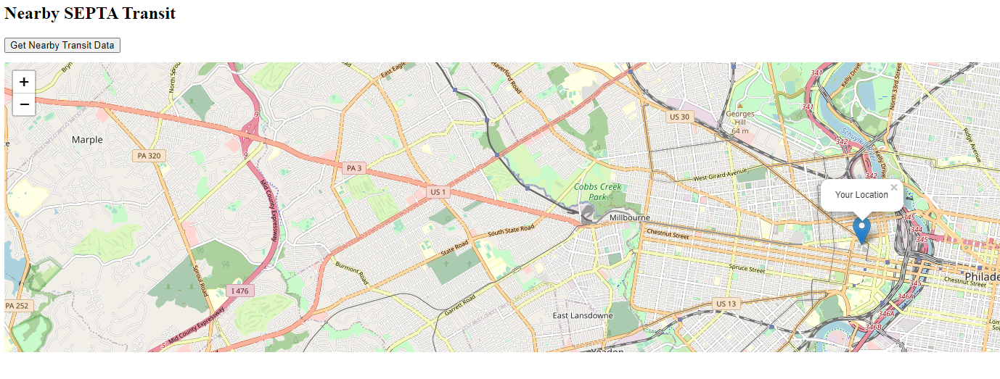
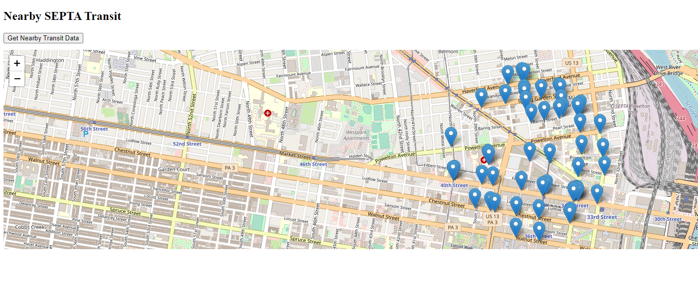

# SEPTA Nearby Transit Web App

This project is a simple exploration into leveraging Flask and API endpoints to create a dynamic web application. The goal is to allow users to visualize nearby transit points provided by SEPTA (Southeastern Pennsylvania Transportation Authority) based on their current location.

## Features
* **Geolocation**: The app retrieves the user's current location.
* **Leaflet Maps Integration**: Visual representation of the user's location and nearby transit points on an interactive map.
* **SEPTA API Integration**: Fetches transit data in real-time using SEPTA's API.
* **Dynamic Content Loading**: Clicking on the "Get Nearby Transit Data" button populates the map with transit data without needing to refresh the entire page.

## Technologies Used
* **Frontend**: HTML, CSS, JavaScript, Leaflet.js for maps
* **Backend**: Python's Flask framework for setting up the server and endpoints
* **APIs**: SEPTA Locations, Schedules, and TransitView API endpoints for retrieving transit data

